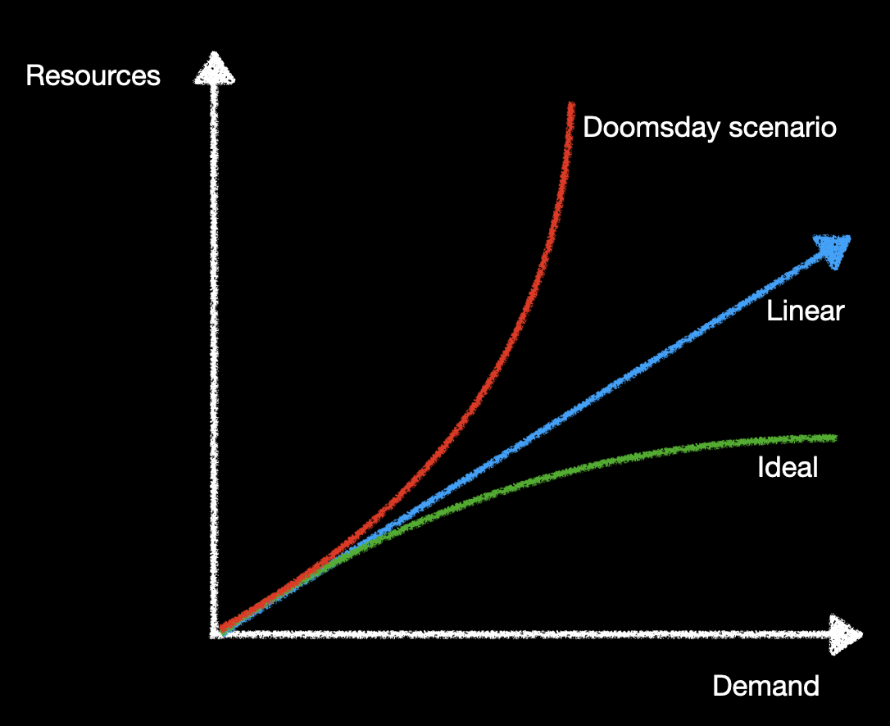
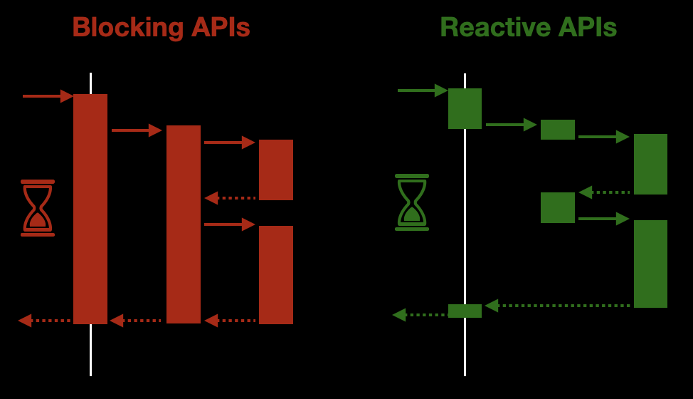

### Reactive history

There have been a long time since the [Reactive Manifesto](https://www.reactivemanifesto.org/) was written in 2013.

Since then, we have seen how the topic of Reactive becomes more and more important.

Only five years ago it was quite difficult to find someone putting in producction a reactive application.

Spring Boot was the king in the Java microservice landscape and Java 8 was the brand-new version of this language. A version full of new features, some of them was going to produce a hugh change inside our traditional programming model.

Nowadays everyone has heard about Reactive, and a lot of people are working with reactive frameworks:
[Micronaut](https://micronaut.io/), [Quarkus](https://quarkus.io/), [Spring Webflux](https://docs.spring.io/spring-framework/docs/current/reference/html/web-reactive.html#webflux), [Akka](https://doc.akka.io/docs/akka/current/index.html), etc...

### Why does Reactive become so popular?

Long time ago, it was completely normal to build applications that would only ever run on a single computer, a single CPU.

If an application wasn’t fast enough, the standard response would be to wait for a while for CPUs to get faster; no need to change any code. Problem solved.

More and better hardware was the standard way to scale software.

Unfortunately, in the last 10 years this situation has changed a lot.

A limit to increasing CPU clock speeds has been reached. The dream was over.



If applications need to perform faster, or if they need to support more users, they will have to be **concurrent**.

We need a new programming model that let us do a better use of our resources.


### What does Reactive really mean?

Reactive is a set of design principles for creating cohesive systems. It’s a way of thinking about systems architecture and design in a distributed environment where implementation techniques, tooling, and design patterns are components of a larger whole.

In this post we are going to focus on one of the aspects in a Reactive System: *Reactive Programming*.

This technique is based on the concept where the availability of new information drives the logic forward rather than having control flow driven by a thread-of-execution.

Interesting... but what does it really mean?

Let's take a look at these two images:



The diagram on the left shows a traditional application, where the thread is blocked all the time. Only when an answerd has been generated then the thread can be released.

On the other hand, the diagram on the right shows a non-blocking application, where each thread is released without waiting for an answer.

In both cases, the answer takes the same time to be delivered to the caller. However, from the point of view of the resources, the non-blocking approach is much better.

We can use the threads and the CPU to do other stuff while we are waiting for someone else to answer us. For example, there is no point in having a thread waiting for the response of an HTTP request. Instead of that, we can release the thread so it can handle other tasks. When the data arrives, we can pickup a thread to process it.

That is what `availability of new information drives the logic` means. Only when the data is ready we are going to allocate resources to process it.

This is by far, a smarter approach to deal with a lot of technical tasks we need to deal with during the execution of our application.

### Working with Reactive applications

But all these benefits do not come for free. 

The imperative way of coding we have been using for a long time is no longer valid.

A simple code fragment like this one does not make sense any more in a reactive application:

````java
Price bookPrice = pricingService.calculatePrice(book);
````

Is is a quite simpe code where we are calling a service to get the price of a set of items.

This kind of code assumes the service will execute the call as soon as we call the method (`calculatePrice`) and that our code will not continue until we have a response.

If we are using an Spring bean or a service created by ourselves, the same Thread we are using to execute this code will execute the code inside `myService` instance.

However, witha reactive approach, this is not true anymore. When we ask a service about some item, that service will execute the logic at some point in the future, but not immediately.

So instead of returning the object we want to use, we are going to have a container that will abstract this behavior.

Some examples:
```java
// Reactor
Mono<Price> bookPrice = pricingService.calculatePrice(book);

// varv
Future<Price> bookPrice = pricingService.calculatePrice(book);

// RxJava
Single<Price> bookPrice = pricingService.calculatePrice(book);
...
```

All of these types are abstractions to deal with the problem that the value (`Price`) might not be computed.


No matter the abstraction we are using (RxJava, reactivex, ...) all of them have set of common characteristics:

* They are cointainers of a not-yet-computed value
* They allow us to *register* what we want to do with the result
* They follow a functional approach:
    * High order functions (map, flatmap, zip, sequence, etc...)
    * Encapsulate errors and deal with team as they were values

So we cannot manipulate Price object directly, unless we make our current thread to wait until the value is computed. 

But this is an anti-pattern, and will break the system.

So instead of making our Thread wait until the Price object arrives, we need a way to tell what we want to do with that object.

It is Functional composition and high order functions to the rescue!

All these types have a toolset full of functions we can use to tell what to do with the result when it finally arrives.

Now lets look at some of these functions:

### Map

This is one of the most famous functors. A lot of data structures and abstractions have this function to manipulate the value inside.

A map allows us to execute a transformation over the value inside a container:

```java
A - map(a -> b) -> B
```


This is probably not the first time you see map in action. A lot of well-known types already have map:

**Optional**

An Optional container is an abstraction to deal with the posibilitiy of the absence of value. When you work with an Optional, you need to take on that there might be a value or nothing (null).

In order to manipulate the value without worrying about whether or not it has a value, we can use map.

For example:

```java
Optional<Book> book = catalogService.findBook(id);
Optional<Price> price = book.map(b -> pricingService.computePrice(b));
```

If there is a book inside the optional, we will compute the price by calling pricingService. However if there is no book (the Optional has null inside), the lambda inside the map will never be called.

So we don't need to worry about null values inside the map. If the lambda is executing, we can be sure that there is a book.

**List**

Inside a List, map function will execute a transformation over each value inside the list.

For example:

```
List<Book> books = catalogService.findBooks(ids);
List<Price> price = books.map(book -> pricingService.computePrice(book));
```

In this case we get a list of books and we transform this list of books into a list of prices.

**Mono**

This abstraction represents the computation of at most one item. So at the end of the background calculations, this Mono will have a single value, nothing (an empty Mono) or an error.

We can use map to tell Mono what to do when the value arrives.

For example:

```java
Mono<Book> book = catalogService.findBook(id);
Mono<Price> price = book.map(b -> pricingService.computePrice(b));
```

The lambda inside map is not going to be executed by this same Thread. Instead of it, the mono will store the lambda so it can be executed over the result value when it arrives.

Suppose that `catalogService.findBook` takes 300ms to find the right book. What is going to happen is that the first Thread will send the task to catalogService and then it will register the lambda.
After that, this Thread can be released to accomplish other tasks. By the time the value arrives, then another Thread will take the lambda inside Mono and will execute it over the result.

The lambda will be executed **only** if there is a value inside the Mono. If the Mono is empty or it ends with a failure inside, the lambda will not be executed.

It is important to note that no matter the container or the abstraction (List, Optional, Mono, Future), our business logic does not change.
The lambda we are executing is always the same: 

```java
b -> pricingService.computePrice(b)
```

That is one of the magic advantages of this approach. 

> Our business logic does not need to know anything about the abstraction.

If we are using Reactor (Mono, Flux, etc...) and for whatever reason we change to RxJava (Single, Flowable, etc...) our business logic will not change.

### Flatmap

Great! Map is just what we need to manipulate objects inside a reactive application.

But wait, what happens when the manipulation does not return another object, but an abstraction with an object inside:


What the hell!! Now we have a container inside another container. If you think it is difficult to work with a `Future` imagine working with a `Future` inside another `Future`:

```java
Future<Future<Price>> price
```

This is for sure something we don't want to work with. 

It is difficult to reason about it: What does it mean? If a `Future` is a *container* of a not yet computed value, a `Future` inside another `Future` is a *container* of a *container* of a not yet computed value.

If we want to apply a transformation over the value (`Price`) then we have to do something like this:

```java
Future<Future<Price>> price = ...;

price.map( 
        anotherFuture -> anotherFuture.map( 
                price -> myService.doSomething(price) 
        ) 
);
```

We need to use a map operator inside another map. This is for sure **too complex**. 

We really don't want to work with this kind of structures.

What can we do to avoid having to work with this data structures?

Flatmap to the rescue!

A `flatmap` operator is just a `map` operator plus a `flatten` one.

```java
flatmap = map + flatten
```

We already know what a map operator is. A flatten operator will collapse two containers to create a single one.

Perfect, because this is just what we need to do in this case.

So a flatmap operator will execute a transformation over the value, and then will collapse two containers into just one.


Let's take a look at several examples using map and flatmap.

**Optional**

Given that:
```java
Optional<Price> computePrice(Book book) { ... }
```

And:
```java
Optional<Book> book = service.findBook(id);
```

When using map:
```java
Optional<Optional<Price>> price = book.map(b -> service.computePrice(b));
```

When using flatmap:
```java
Optional<Price> price = book.flatmap(b -> service.computePrice(b));
```

Notice that in this case map will return an Optional inside another Optional. 
That structure makes no sense and it is difficult to work with it, so flatmap is better option here. 

**List**

Given that:
```java
List<Skills> findSkills(Developer developer) { ... }
```

And:
```java
List<Developer> developers = service.findDevelopers(ids);
```

When using map:
```java
List<List<Price>> skills = developers.map(dev -> service.findSkills(dev));
```

When using flatmap:
```java
List<Price> skills = developers.flatmap(dev -> service.findSkills(dev));
```

In this case we have a service that returns a list of skills of a given developer.

If we want to know all the skills our staff have, it is better to use flatmap, because with map we will end up having a list of lists.

**Mono**

Given that:
```java
Mono<Price> computePrice(Book book) { ... }
```

And:
```java
Mono<Book> book = service.findBook(id);
```

When using map:
```java
Mono<Mono<Price>> price = book.map(b -> service.computePrice(b));
```

When using flatmap:
```java
Mono<Price> price = book.flatmap(b -> service.computePrice(b));
```

This is a very common case in a rective application. 

We have an abstraction with a not-yet-computed value insie (`Mono<Book>`).

We want to use that entity to compute another one. But the service we need to call is also reactive, so instead of returning a `Price` object it will return another abstraction with a not-yet-computed value inside: `Mono<Price>`.

If we try to use map, we will end up with a very complex structure: 

```java
Mono<Mono<Price>>
```

That is the reason we really want to use flatmap in this kind of operations.

### Map vs Flatmap

> If the transformation you want to apply returns a value use map. However, if the transformation you need to apply returns the value inside an abstraction, then use flatmap to avoid having a value in a two-deep abstraction level. 

### Conclusion

Creating a reactive application, using reactive programming model, has a lot of benefits.

It is a programming model that will help us build systems that are well prepared to meet the increasing demands that applications face today.

The foundation for a Reactive application is Message-Passing. It creates a boundary between our components which allow them to be decoupled in time and in space.

This kind of applications let us build resilience patterns easily: bulkheading, disaster recovery strategies, selective scaling, etc...

However, it comes with a price. You need to work with these systems in a completely different way you have been doing till now.

In this short article we have learnt how two high order functions (`map` and `flatmap`) can help us work with this new model.