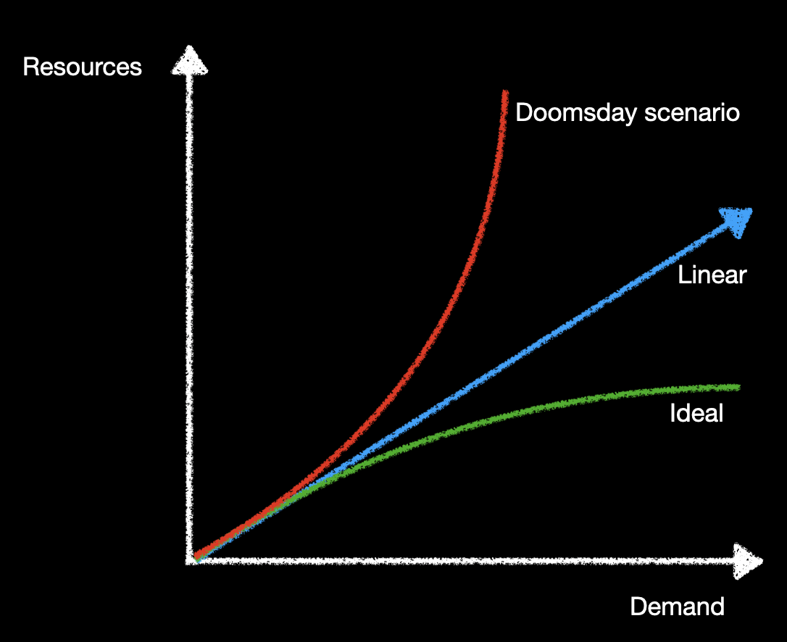
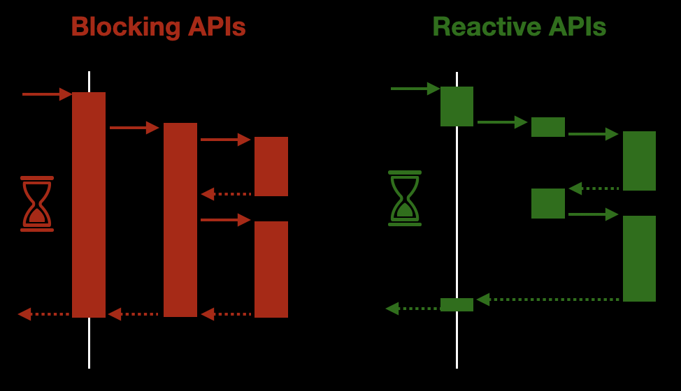

## Reactive programming model

There have been a long time since the [Reactive Manifesto](https://www.reactivemanifesto.org/) was written in 2013.

Since then, we have seen how the topic of Reactive becomes more and more important.

Only five years ago it was quite difficult to find someone putting in producction a reactive application.

Spring Boot was the king in the Java microservice landscape and Java 8 was the brand-new version of this language. A version full of new features, some of them was going to produce a hugh change inside our traditional programming model.

Nowadays everyone has heard about Reactive, and a lot of people are working with reactive frameworks:
[Micronaut](https://micronaut.io/), [Quarkus](https://quarkus.io/), [Spring Webflux](https://docs.spring.io/spring-framework/docs/current/reference/html/web-reactive.html#webflux), [Akka](https://doc.akka.io/docs/akka/current/index.html), etc...

### Why does Reactive become so popular?

Long time ago, it was completely normal to build applications that would only ever run on a single computer, a single CPU.

If an application wasn’t fast enough, the standard response would be to wait for a while for CPUs to get faster; no need to change any code. Problem solved.

More and better hardware was the standard way to scale software.

Unfortunately, in the last 10 years this situation has changed a lot.

A limit to increasing CPU clock speeds has been reached. The dream was over.

If applications need to perform faster, or if they need to support more users, they will have to be **concurrent**.

We need a new programming model that let us do a better use of our resources.

### What does Reactive really mean?

Reactive is a set of design principles for creating cohesive systems. It’s a way of thinking about systems architecture and design in a distributed environment where implementation techniques, tooling, and design patterns are components of a larger whole.

In this post we are going to focus on one of the aspects in a Reactive System: *Reactive Programming*.

This technique is based on the concept where the availability of new information drives the logic forward rather than having control flow driven by a thread-of-execution.

Interesting... but what does it really mean?

Let's take a look at these two images:

The diagram on the left shows a traditional application, where the thread is blocked all the time. Only when an answerd has been generated then the thread can be released.

On the other hand, the diagram on the right shows a non-blocking application, where each thread is released without waiting for an answer.

In both cases, the answer takes the same time to be delivered to the caller. However, from the point of view of the resources, the non-blocking approach is much better.

We can use the threads and the CPU to do other stuff while we are waiting for someone else to answer us. For example, there is no point in having a thread waiting for the response of an HTTP request. Instead of that, we can release the thread so it can handle other tasks. When the data arrives, we can pickup a thread to process it.

That is what `availability of new information drives the logic` means. Only when the data is ready we are going to allocate resources to process it.

This is by far, a smarter approach to deal with a lot of technical tasks we need to deal with during the execution of our application.

